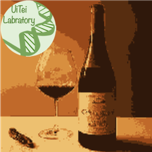
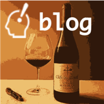

# iwasakishuto.github.io

https://iwasakishuto.github.io is my portfolio. Please look around!!

## Contents

|Python-Charmers|Translation-Gummy|Kerasy|Form-Auto-Fill-In|
|:-:|:-:|:-:|:-:|
|  |  |  |  |
|Ui-Tei Lab|University Notes|Blog|Front-End portfolio|
|  |  |  |  |

## Acknowledgement

I am deeply grateful to [CISCO](https://www.cisco.com/c/m/en_us/solutions/enterprise-networks/digital-network-architecture/dna-mobility-infographic.html). I swear not to use this site for commercial use.