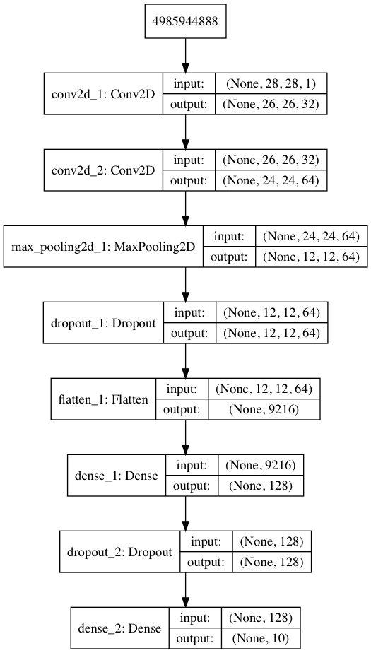

# MNIST
>The MNIST database (Modified National Institute of Standards and Technology database) is a large database of handwritten digits that is commonly used for training various image processing systems. The database is also widely used for training and testing in the field of machine learning (Wikipedia)

MNIST is also called <b>"Hello World" dataset of computer vison</b>, so I chose this as my first `TensorFlow.js` app.

## Training
The way of training is following the [Keras Documentation](https://keras.io/examples/mnist_cnn/), and you can look the entire code at [Training.ipynb](https://github.com/iwasakishuto/iwasakishuto.github.io/blob/master/js/TensorFlowJs/MNIST/Training.ipynb).

The model architecture is as below;

